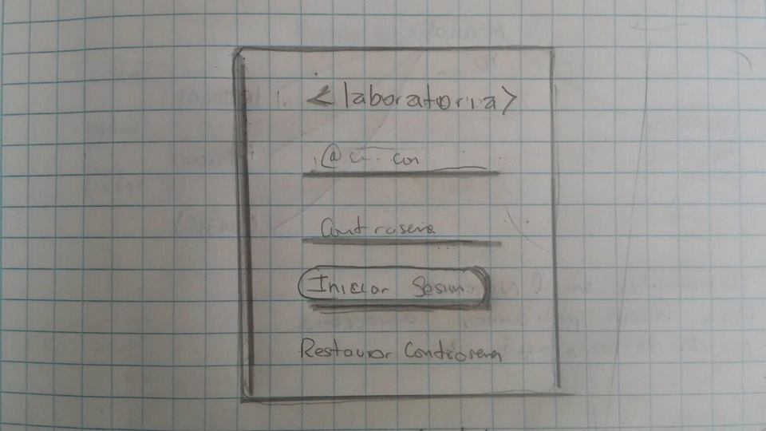
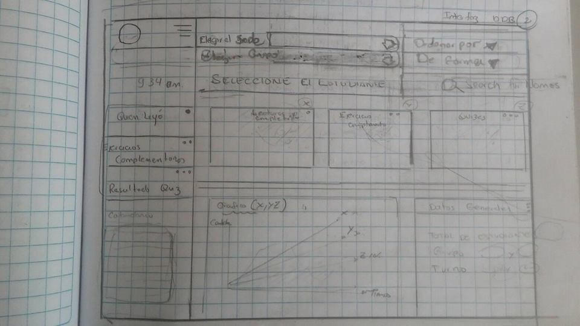
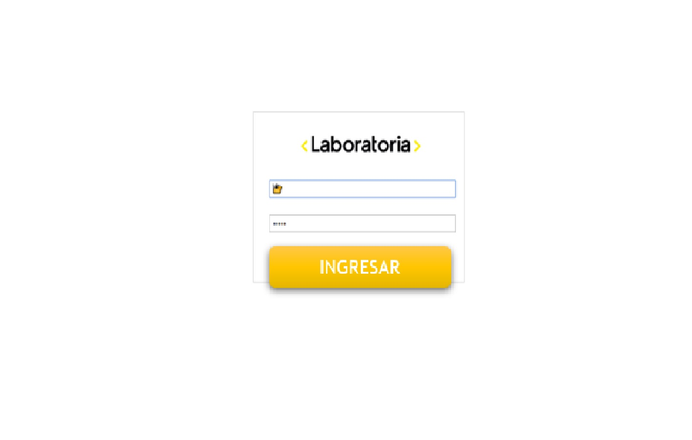
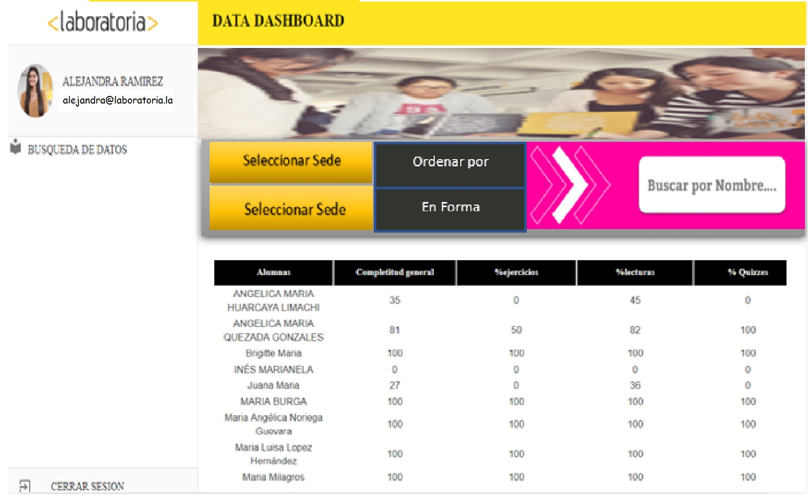
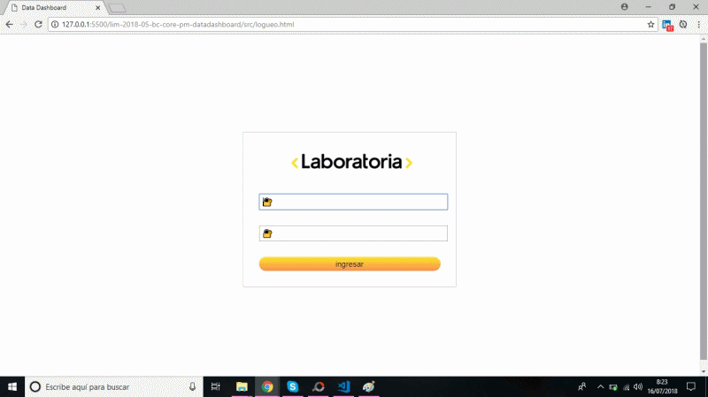

# Data Dashboard

# Integrantes
  - Ivonne Huatuco Gabriel
  - Maricielo Ari Mahallanes

# Etapas Preliminares ante el Proyecto

## Preámbulo

En Laboratoria, las Training Managers (TMs) hacen un gran trabajo al analizar la
mayor cantidad de datos posibles respecto al progreso de las estudiantes para
apoyarlas en su aprendizaje.

La principal medida de progreso de una estudiante en Laboratoria es su avance
completando los proyectos de la [Ruta de Aprendizaje](https://docs.google.com/spreadsheets/d/1AoXQjZnZ5MTPwJPNEGDyvn5vksiOUoPr932TjAldTE4/edit#gid=536983970)
y su desempeño en función a la [Rúbrica de Niveles Esperados](https://docs.google.com/spreadsheets/d/e/2PACX-1vSkQy1waRpQ-16sn7VogiDTy-Fz5e7OSZSYUCiHC_bkLAKYewr4L8pWJ_BG210PeULe-TjLScNQQT_x/pubhtml).
Sin embargo, para completar estos proyectos las estudiantes acceden a contenidos
de aprendizaje (lecturas, videos, ejercicios y quizzes) en un sistema que
llamamos LMS (Learning Management System). El LMS acumula data sobre quién
leyó qué, qué ejercicios se han completado, los resultados de los quizzes, etc.

A pesar de que la data de progreso del LMS (ej. lecturas leídas, ejercicios
  completados, nota en quizzes, etc.) no impacta directamente en la evaluación
  de una estudiante, sí es una pieza de información relevante que las TMs
  quisieran visualizar para tener un mejor entendimiento de cómo va cada
  estudiante en su proceso de aprendizaje.

Así, el reto de este proyecto es crear una interfaz donde las TMs puedan
_ver_ y _usar_ la data de progreso del LMS. Para ello, proponemos crear un
**data dashboard** (_tablero de visualización de datos_).


## Aplicaciones en el mundo real


En el mundo de la web es muy común el uso de _dashboards_. De hecho, [wikipedia](https://goo.gl/P7PF4y)
nos dice que un _dashboard_ puede ser un resumen gráfico de varias piezas de
información importante, generalmente utilizadas para dar una visión general de
una empresa o de un servicio. Así, tenemos dashboards como los de:

* [Google Analytics](https://assets.econsultancy.com/images/resized/0003/3813/mobile_commerce_dashboard-blog-full.png)
  para visualizar la data de tráfico de sitios web.

* [Mailchimp](https://blog.mailchimp.com/wp-content/uploads/2016/11/Dashboard-view-3-Copy-1008x768.jpg)
  para visualizar el desempeño de campañas de mercadeo digital por correo
  electrónico.

* [Quickbooks](https://quickbooks.intuit.com/content/dam/intuit/quickbooks/branding/make-organization-easy-visual.png)
  para visualizar la información financiera de una empresa.

## Consideraciones generales

La lógica del proyecto està implementado en JavaScript
(ES6), HTML y CSS. 

El _boilerplate_ contiene una estructura de archivos de la forma siguiente.

```text
./
├── .editorconfig
├── .eslintrc
├── .gitignore
├── README.md
├── data
│   ├── cohorts
│   │   └── lim-2018-03-pre-core-pw
│   │       ├── progress.json
│   │       └── users.json
│   └── cohorts.json
├── package.json
├── src
│   ├── data.js
│   ├── index.html
│   ├── main.js
│   └── style.css
└── test
    ├── data.spec.js
    ├── fixtures.js
    ├── headless.js
    └── index.html
```

La carpeta `data/` dentro del _boilerplate_ incluye un extracto de la data que
podemos usar tanto en los tests como en la interfaz en sí.


#### 1) Definición del producto

En esta etapa surgieron muchas ideas para desarrollar la aplicación y nos basamos en esta serie de preguntas: 

1. Quiénes son los principales usuarios de producto.
2. Cuáles son los objetivos de estos usuarios en relación con el producto.
3. Cuáles son los datos más relevantes que quieren ver en la interfaz y por qué. Cómo se descubrio.
4. Cuándo revisan normalmente estos datos los usuarios.
5. Cómo crees que el producto les está resolviendo sus problemas.
6. Cómo fue tu proceso de diseño.

Si pensamos en la mejor forma de recopilar información y saber lo que cliente desea es la entrevista con el propio cliente antes de ello realizamos detalladas preguntas relacionadas a la necesidad del cliente luego acordamos una entrevista para que nos diga lo que quiere conseguir con este proyecto.


#### 2) Sketch de la solución (prototipo de baja fidelidad)

Luego de la entrevista realizamos un prototipo de baja fidelidad considerando los datos que nos brindo nuestra TM en la entrevista que se le hizo de esta manera tener una idea para realizar el prototipo de alta fidelidad.

El prototipo de baja fidelidad nos ayuda a realizar el prototipo de alta fidelidad, a continuaciòn mostramos nuestros bocetos.

 Boceto de Logueo:
 
Boceto de Interfaz Datadashboard:
 

#### 3) Diseño de la Interfaz de Usuario (prototipo de alta fidelidad)

El prototipo de Alta Fidelidad es el que no necesariamente ponemos como resultado final pero si nos ayuda a que el cliente nos brinde feedback del diseño realizado para poder realizar los cambios necesarios.

 
  

### Implementación del Producto y Modo de Uso:

DEMO DEL PRODUCTO:


La implementaciòn cuenta con los siguientes puntos:

1. Permitir al usuario seleccionar un cohort de una lista de cohorts.
2. Al seleccionar un cohort:
   - Listar las estudiantes de ese cohort
   - Para cada estudiante:
     + Calcular porcentaje de completitud de todos los _cursos_.
     + Calcular grado de completitud de _lecturas_, _ejercicios autocorregidos_,
       y _quizzes_.
   - Ordenar estudiantes por completitud _general_ (porcentaje consumido/completado
     de todos los cursos del cohort en cuestión), de _lecturas_, _ejercicios
     autocorregidos_ y _quizzes_.
   - Filtrar/buscar estudiantes por nombre.
3. Visualizarse sin problemas desde distintos tamaños de pantallas: móviles,
   tablets y desktops.
4. Incluir pruebas unitarias.

El producto podrà ejecutarse desde cualquier punto que tenga conecciòn a Internet desde distintos tamaños de pantalla.

## Detalles de Implementación

### data.js

El corazón de este proyecto es la manipulación de datos a través de arreglos y
objetos. La idea de este archivo es contener toda la funcionalidad
que corresponda a obtener, procesar y manipular datos.

Parte de un buen proyecto es que esté ordenado y que otras programadoras puedan
acceder a el código rápidamente. Es por esto que este orden no es casualidad y
es una convención que generalmente encontrarás en internet bajo el nombre MVC o
Modelo Vista Controlador. En este proyecto Controlador y Modelo estarán bajo
el archivo **data.js**.

El _boilerplate_ incluye tests que esperan que implementes las
siguientes 4 funciones y las _exportes_ al entorno global (`window`) dentro del
script `src/data.js`, ten en cuenta que esto es solo lo básico, si necesitas más
funciones puedes hacerlo:

#### 1) `computeUsersStats(users, progress, courses)`

Esta función es la responsable de "crear" la lista de usuarios (estudiantes)
que vamos a "pintar" en la pantalla. La idea es "recorrer" el arreglo de
usuarios (`users`) y calcular los indicadores necesarios de progreso para cada
uno. La función debe devolver un nuevo arreglo de usuarios donde a cada objeto
de usuario se le debe agregar una _propiedad_ con el nombre `stats` con las
estadísticas calculadas.

##### Argumentos

* `users`: Arreglo de objetos obtenido de la data en bruto.
* `progress`: Objeto de progreso en bruto. Contiene una llave para cada usuario
  (`uid`) con un objeto que contiene el progreso del usuario para cada curso.
* `courses`: Arreglo de _strings_ con los _ids_ de los cursos del cohort en
  cuestión. Esta data se puede extraer de la propiedad `coursesIndex` de los
  objetos que representan los _cohorts_.

##### Valor de retorno

Un arreglo de objetos `usersWithStats` con la propiedad `stats`, la cual debe ser un
objeto con las siguientes propiedades:

* `percent`: Número entero entre 0 y 100 que indica el porcentaje de completitud
  general del usuario con respecto a todos los cursos asignados a su cohort.
* `exercises`: Objeto con tres propiedades:
  - `total`: Número total de ejercicios autocorregidos presentes en cursos del
    cohort.
  - `completed`: Número de ejercicios autocorregidos completados por el usuario.
  - `percent`: Porcentaje de ejercicios autocorregidos completados.
* `reads`: Objeto con tres propiedades:
  - `total`: Número total de lecturas presentes en cursos del cohort.
  - `completed`: Número de lecturas completadas por el usuario.
  - `percent`: Porcentaje de lecturas completadas.
* `quizzes`: Objeto con cinco propiedades:
  - `total`: Número total de quizzes presentes en cursos del cohort.
  - `completed`: Número de quizzes completadas por el usuario.
  - `percent`: Porcentaje de quizzes completadas.
  - `scoreSum`: Suma de todas las puntuaciones (score) de los quizzes
    completados.
  - `scoreAvg`: Promedio de puntuaciones en quizzes completados.

#### 2) `sortUsers(users, orderBy, orderDirection)`

La función `sortUsers()` se encarga de _ordenar_ la lista de usuarios creada con
`computeUsersStats()` en base a `orderBy` y `orderDirection`.

##### Argumentos

* `users`: Arreglo de objetos creado con `computeUsersStats()`.
* `orderBy`: String que indica el criterio de ordenado. Debe permitir ordenar
  por nombre, porcentaje de completitud total, porcentaje de ejercicios
  autocorregidos completados, porcentaje de quizzes completados, puntuación
  promedio en quizzes completados, y porcentaje de lecturas completadas.
* `orderDirection`: La dirección en la que queremos ordenar. Posibles valores:
  `ASC` y `DESC` (ascendiente y descendiente).

##### Valor de retorno

Arreglo de usuarios ordenado.

#### 3) `filterUsers(users, search)`

##### Argumentos

* `users`: Arreglo de objetos creado con `computeUsersStats()`.
* `search`: String de búsqueda.

##### Valor de retorno

Nuevo arreglo de usuarios incluyendo solo aquellos que cumplan la condición de
filtrado, es decir, aquellos que contengan el string _search_ en el nombre
(`name`) del usuario.

#### 4) `processCohortData(options)`

Esta función es la que deberíamos usar al seleccionar un cohort y cada vez que
el usuario cambia los criterios de ordenado y filtrado en la interfaz. Esta
función debe invocar internamente a `computeUsersStats()`, `sortUsers()` y
`filterUsers()`.

##### Argumentos

* `options`: Un objeto con las siguientes propiedades:
  - `cohort`: Objeto cohort (de la lista de cohorts)
  - `cohortData`: Objeto con dos propiedades:
    + `users`: Arreglo de usuarios miembros del cohort.
    + `progress`: Objeto con data de progreso de cada usuario en el contexto de
      un cohort en particular.
  - `orderBy`: String con criterio de ordenado (ver `sortUsers`).
  - `orderDirection`: String con dirección de ordenado (ver `sortUsers`).
  - `search`: String de búsqueda (ver `filterUsers`)

##### Valor de retorno

Nuevo arreglo de usuarios _ordenado_ y _filtrado_ con la propiedad `stats`
añadida (ver `computeUsersStats`).

### main.js

Ten en cuenta también que existe otro archivo _main.js_ que no está solo por
casualidad en la estructura del proyecto. En general es una buena idea ir
separando la funcionalidad en varios archivos, ya que a medida que un proyecto
crece, se vuelve insostenible dejar todo en un solo archivo. En este caso puedes
usar _main.js_ para todo tu código que tenga que ver con mostrar los datos en la
pantalla, y _data.js_ para todas las funciones que vimos que obtienen y
manipulan los datos.

Esta no es la única forma de dividir tu código, puedes usar más archivos y
carpetas, siempre y cuando la estructura sea clara para tus compañeras.

### index.html

Al igual que en el proyecto anterior, también existe un archivo `index.html`.
Como ya sabrás, acá va la página que se mostrará al usuario de este tablero de
información. También nos sirve para indicar qué scripts se usarán y unir todo lo
que hemos hecho.

### Data

En esta carpeta están los datos de prueba del proyecto, contiene información
sobre los cohorts (grupos de estudiantes de una generación y rama en particular),
estudiantes y su progreso en cada uno de los cursos que son parte de cada cohort.
Para poder usar cada uno de los archivos JSON, puedes ocupar el mismo método que
usarías si es que estuvieses haciendo una llamada HTTP o a una API, pero usando
una dirección **relativa**, ejemplo:

```javascript
"../data/cohorts.json"
```

### Tests

Tendrás también que completar las pruebas unitarias de estas funciones que se
incluyen en el _boilerplate_, que encontrarás en el archivo `data.spec.js`.
Si te fijas bien en la carpeta también encontrarás otros archivos, que
detallaremos a continuación:

#### index.html

No confundas este archivo con tu `index.html` del proyecto, este archivo es
especial para los test y es una manera de ver el resultado de tus pruebas
unitarias, pero en el navegador. Para arrancar las pruebas de esta forma,
escribe en tu consola:

```javascript
npm run test-browser
```

Una página se abrirá en tu navegador conteniendo los resultados de las pruebas.

#### fixtures.js

Muy importante archivo, aunque no siempre estará (depende del proyecto). Acá es
donde está el set de datos de prueba que se usarán para correr las pruebas.
